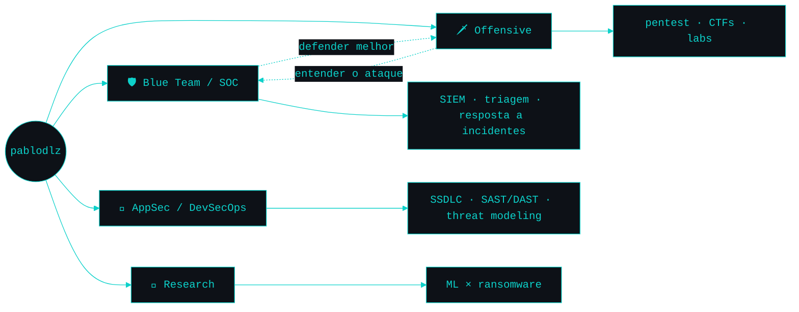

<div align="center">

# Pablo Galerani

<code>Security&nbsp;Operations</code> · <code>Offensive&nbsp;Security</code> · <code>AppSec</code>

<br/>

[](https://pablodlz.github.io/portfolio/)

<br/>

[](https://pablodlz.github.io/portfolio/)
[](https://www.linkedin.com/in/pablodlz/)
[](https://hackerone.com/pablodlz)
[](https://bugcrowd.com/h/pablodlz)
[](https://profile.hackthebox.com/profile/019f2afa-cb43-718d-91a5-8d4f51e292a0f)
[](https://app.letsdefend.io/user/pablodlz)
[](mailto:pablogalerani@gmail.com)

</div>

<br/>

```bash
Last login: Sex, 10 jul 2026 17:15 -03 from 10.10.14.7
uptime: 282 dias operando no SOC @ Clavis · rumo ao OSCP

$ whoami
pablodlz — SOC Analyst @ Clavis Segurança da Informação

$ cat about.txt
Blue team de dia, labs ofensivos à noite —
entender o ataque é a melhor forma de defender.

  formação   Tecnólogo em Segurança da Informação · Fatec
             Pós em Cibersegurança Ofensiva · Acadi-TI
  local      Jacarezinho, PR — Brasil
  foco       SOC · SIEM · Pentest · AppSec / DevSecOps
```

<br/>

### `> map --areas`



<br/>

### Stack

<sub>**Blue Team / SOC**</sub><br/>


<sub>**Offensive Security**</sub><br/>


<sub>**AppSec / DevSecOps**</sub><br/>


<sub>**Linguagens & Ambiente**</sub><br/>


<sub>🔬 &nbsp;Pesquisa · Machine Learning aplicado à detecção de ransomware — artigo científico em publicação.</sub>

<br/>

### Certs

<code>CEH v13 (AI)</code> · <code>CNSE</code> · <code>CSAE</code> · <code>CPTE</code> · <code>CRTA</code> &nbsp;—&nbsp; **50+** &nbsp;·&nbsp; próximos: <code>Security+</code> <code>eJPT</code> <code>OSCP</code>

<br/>

### `> cat foco.md`

```text
▸ aprofundando red team / pentest — rumo ao CRTA e ao OSCP
▸ CEH v13 (AI) em andamento
▸ publicando artigo: ML aplicado à detecção de ransomware
▸ rotina de CTFs & labs — Hack The Box · TryHackMe · LetsDefend
```

<br/>

### `> ls ~/projetos`

| | |
|---|---|
| [**portfolio**](https://github.com/pablodlz/portfolio) | Site interativo com terminal Kali funcional (~90 comandos), pet cyber **b1t** e CSP estrita — Astro · TypeScript. **[demo ao vivo ↗](https://pablodlz.github.io/portfolio/)** |
| [**writeups**](https://github.com/pablodlz/writeups) | Notas de CTFs, labs e máquinas (HTB · TryHackMe · LetsDefend) — metodologia consistente, do recon ao report. |
| [**pablodlz**](https://github.com/pablodlz/pablodlz) | Este perfil — escrito *spec-driven* ([spec](specs/profile-readme.md)) e mantido vivo por GitHub Actions. |

<br/>

### `> tail -f atividade.log`

<!--ATIVIDADE:START-->
```text
[10/07 16:39] push     pablodlz     → main
[10/07 16:27] push     pablodlz     "chore: ignora __pycache__"
[10/07 16:23] push     pablodlz     "README v4: secoes dinamicas (Actions) + proje…"
[10/07 15:56] push     pablodlz     "README v3: reformulacao minimalista, tema tea…"
[10/07 15:41] push     portfolio    "."
[10/07 15:28] push     portfolio    "."
```
<!--ATIVIDADE:END-->
<sub>🤖 atualizado automaticamente a cada 8h via GitHub Actions</sub>

<br/>

### `> neofetch`

<!--NEOFETCH:START-->
```text
aguardando primeira execução do bot…
```
<!--NEOFETCH:END-->

<br/>

### `> languages --top`

<!--LANGS:START-->
```text
aguardando primeira execução do bot…
```
<!--LANGS:END-->

<sub>📊 stats e linguagens computados por mim mesmo via GitHub Actions — sem depender de serviços que caem.</sub>

<br/>

### `> git log --graph`  ·  contribuições

<div align="center">


</div>

---

<div align="center">

```bash
$ ./pablodlz.sh          # o tour completo tá no portfólio ↴
```

**[pablodlz.github.io/portfolio](https://pablodlz.github.io/portfolio/)**

</div>
