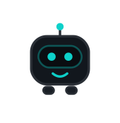
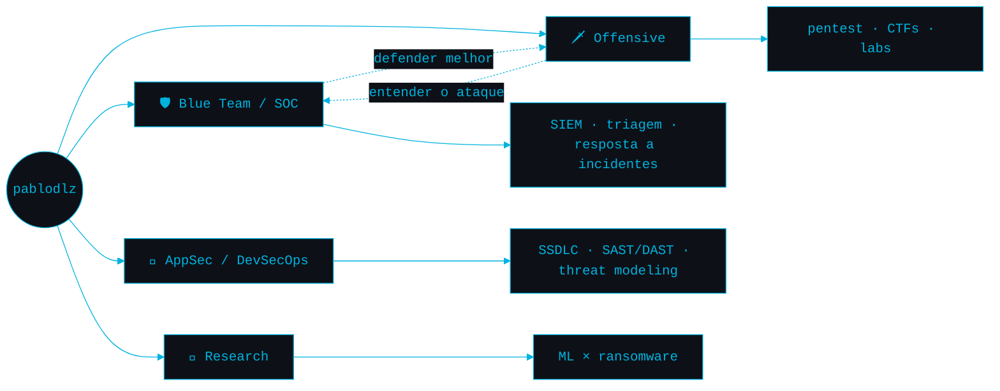

<table align="center" width="100%">
<tr>
<td valign="middle">
<div align="center">
<h1>Pablo&nbsp;Galerani</h1>
<code>Security&nbsp;Operations</code> · <code>Offensive&nbsp;Security</code> · <code>AppSec</code>
</td>
<td valign="middle" align="center">

<br/><br/>
<a href="https://pablodlz.github.io/portfolio/"></a> </br>
</td>
</tr>
</table>

<div align="center">

<br/>

[](https://pablodlz.github.io/portfolio/)

<br/>

[](https://pablodlz.github.io/portfolio/)
[](https://www.linkedin.com/in/pablodlz/)
[](https://hackerone.com/pablodlz)
[](https://bugcrowd.com/h/pablodlz)
[](https://profile.hackthebox.com/profile/019f2afa-cb43-718d-91a5-8d4f51e292a0f)
[](https://app.letsdefend.io/user/pablodlz)
[](mailto:pablogalerani@gmail.com)

</div>

<br/>

### Sobre mim

```bash
uptime: Operando no SOC @ Clavis

┌─(𝗿𝗼𝗼𝘁㉿𝗸𝗮𝗹𝗶)-[~]
└# whoami
pablodlz — SOC Analyst @ Clavis Segurança da Informação

┌─(𝗿𝗼𝗼𝘁㉿𝗸𝗮𝗹𝗶)-[~]
└# cat about.txt
· Blue team de dia, labs ofensivos à noite
· Entender o ataque é a melhor forma de defender.

  Formação   Tecnólogo em Segurança da Informação · Fatec
             Pós em Cibersegurança Ofensiva · Acadi-TI
  Local      Paraná, Brasil
  Foco       SOC · SIEM · Pentest · AppSec / DevSecOps
```

<br/>

### Roadmap



<br/>

### Stack

<sub>**Blue Team / SOC**</sub><br/>


<sub>**Offensive Security**</sub><br/>


<sub>**AppSec / DevSecOps**</sub><br/>


<sub>**Linguagens & Ambiente**</sub><br/>


<sub>**Pesquisa:**</sub><br/>
Undersampling applied to Ransomware Detection: An Analysis of NearMiss and Random Undersampling Techniques — artigo científico em publicação.</sub>

<br/>

### Certificações

<code>CNSE</code> · <code>CSAE</code> · <code>CPTE</code> - Concluídas.

<code>CEH v13 (AI)</code> · <code>CRTA</code> - Em andamento.

<code>Security+</code> <code>eJPT</code> <code>OSCP</code> - Próximos alvos.

<br/>

### Projetos

|  |  |
| --- | --- |
| [**portfolio**](https://github.com/pablodlz/portfolio) | Site interativo com terminal Kali funcional (~90 comandos), pet cyber **b1t** e CSP estrita — Astro · TypeScript. **[Demo ao vivo ↗](https://pablodlz.github.io/portfolio/)** |
| [**pablodlz**](https://github.com/pablodlz/pablodlz) | Este perfil — escrito *spec-driven* ([spec](specs/profile-readme.md)) e mantido vivo por GitHub Actions. |
| [**AppSec**](https://www.linkedin.com/in/pablodlz/) | Application Security - Como implementar o Ciclo de Vida de Desenvolvimento de Software Seguro (SSDLC) do zero |

<br/>

<div align="center">

### Streak & Coding time


</div>

### Contribuições


</div>

